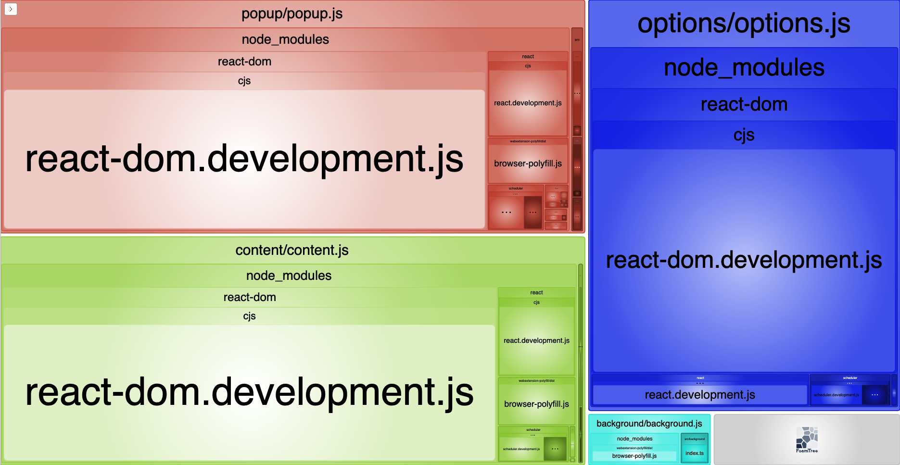

# React Extension Boilerplate

Works for Chrome, Opera, Edge & Firefox.

## Features

>- ___Supports Manifest Version 3___
>  
>- ___Write in your favorite framework - React! :)___
>  
>   Now you can create part of your extensions in React framework - as you wish ;)
>
>- ___Write once and deploy to Chrome, Opera, Edge & Firefox___
>
>   Based on `webextension-polyfill`. It also includes a tiny polyfill to bring uniformity to the APIs exposed by different browsers.
>
>- ___Live-reload___
>
>   Your changes to CSS, HTML & JS files will be relayed instantly without having
>   to manually reload the extension. This ends up saving a lot of time and
>   improving the developer experience. Based on `web-ext-reloader-mv3`
>
>- ___Newest js technology stack___
>
>   You can use `Typescript` or `Babel`
>
>- ___Profiling JS Packages___
>
> 
>
>- ___Comfortable styles import___
>
>   With react you can load styles directly and you can use scss for styling.
>
>- ___Easily configurable and extendable___
>
>   Project use webpack so you can easily customize your project depends on your needs.
>  In config.json you can define source path for each browser
>  (if needed - default it's the same source), destination and develop directory.
>
>- ___Clean code___
>
>   Clean code is the best way for long term support for project. Boilerplate has
>  fully configured eslint with airbnb style guide.
>
>- ___Test your components!___
>
>   Project use some library which support your testing process.
>  As test runner we use karma, as testing framework mocha.
>  As support to assertion we use chai.

## Run & Installation

>### Run & Build
>
>> 1. Clone the repository `git clone https://github.com/WebExp0528/React-Extension-Boilerplate.git`. If you want to use Babel, `git clone --single-branch --branch babel https://github.com/WebExp0528/React-Extension-Boilerplate.git`
>> 2. Run `npm install` or `yarn install`
>> 3. Run `npm run build:{target browser}` or `yarn build:{target browser}`. EX: `yarn build:chrome`
>>
>> Note: You can [download](https://github.com/WebExp0528/React-Extension-Boilerplate/releases/latest) build file
>
>### Load the extension in Chrome & Opera
>
>> 1. Open Chrome/Opera browser and navigate to chrome://extensions
>> 2. Select "Developer Mode" and then click "Load unpacked extension..."
>> 3. From the file browser, choose to `React-Extension-Boilerplate/dev/chrome`
>> or > (`React-Extension-Boilerplate/dev/opera`)
>
>### Load the extension in Firefox
>
>>1. Open Firefox browser and navigate to about:debugging
>>2. Click "Load Temporary Add-on" and from the file browser, choose >>`React-Extension-Boilerplate/dev/firefox`
>
>### Load the extension in Edge
>
>><https://docs.microsoft.com/en-us/microsoft-edge/extensions/guides/>adding-and-removing-extensions>

## Developing

>The following tasks can be used when you want to start developing the extension
>and want to enable live reload -
>`npm run dev:{target browser}` or `yarn dev:{target browser}`

## Profiling

> Run `npm run profile:{target browser}` or `yarn profile:{target browser}`

## Packaging

>Run `npm run build:{target browser}` or `yarn build:{target browser}` to create a zipped,
production-ready extension for each browser.
You can then upload that to the app store.

## Available Target Browsers

> `chrome` `firefox` `opera` `edge`

---

This project is licensed under the MIT license.

If you have any questions or comments, please create a new issue.
I'd be happy to hear your thoughts.
